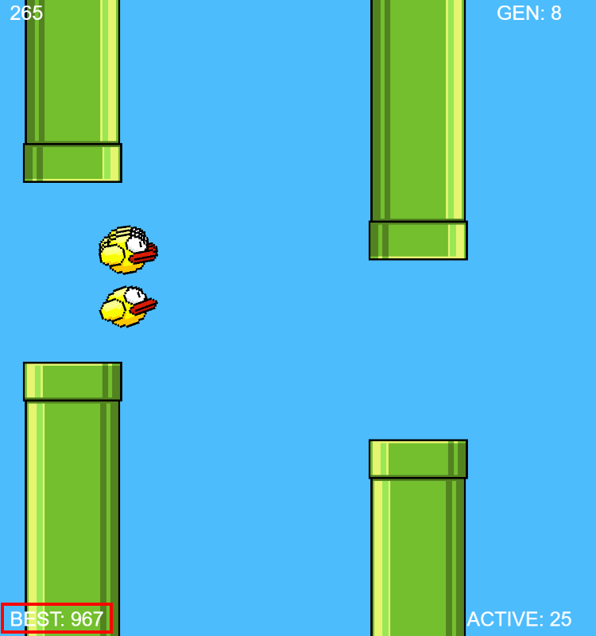

# Neural Network Flappy Bird
A simple AI that learns to play Flappy Bird.

If you want to try it: https://materight.github.io/flappy-bird/

## Neural netwoek implementation
Each birda has it's own neural network, is based on 3 layers:
 - An **input layer**, with 4 nodes that rappresents what the bird can see:
    1. vertical distance from the ground
    2. horizontal distance from the next pipe
    3. vertical distance from the top pipe
    4. vertical disance from the bottom pipe
 - An **hidden layer**, with 6 nodes
 - An **output layer**, with 1 node:
    - if the output value is > 0, the bird jump 
The activation function used it's **tanh()**

## Genetic algorithm 
The neural network is trained using a simple genetic algorithm. 

When starting a random population of 100 birds is created. The weight and bias values are assigned randomly using the **Xavier initialization**.

The fitness value is calculated as `travelled distance - vertical distance from the next pipe center`. This way if 2 birds travel the same distance, the one closer to the center of the pipe is considered better.

When all birds are killed, a new population is created:
 - The first 2 birds are passed into the next generation
 - All the others are created by a crossover between the 2 best. The crossover point is randomly chosen with a normal distribution. Each new created child is then mutated with a small probability.

## Usage
Simply run a web server and open index.html.
Also you can press:
 - `f` to speed up the game 
 - `s` to slow down the game

## Result
After tweaking some of the parameters, this is the best it reached.

